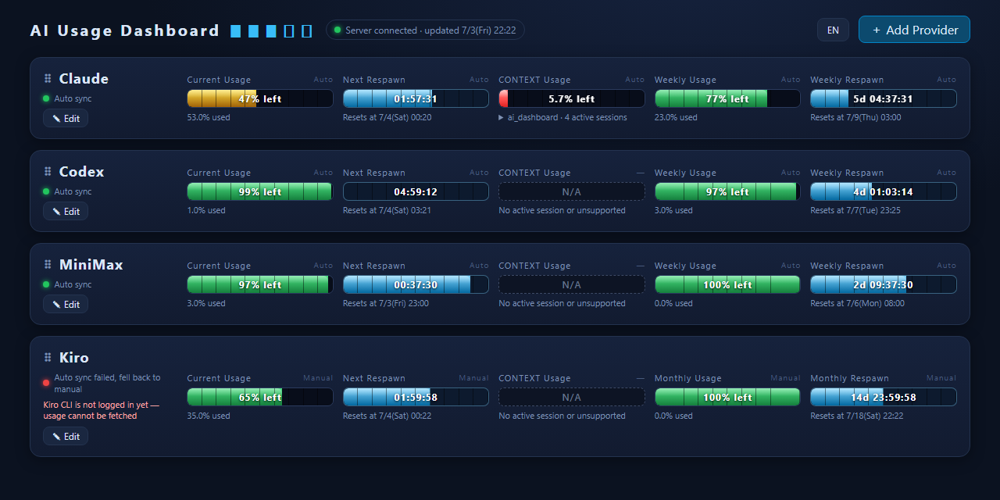
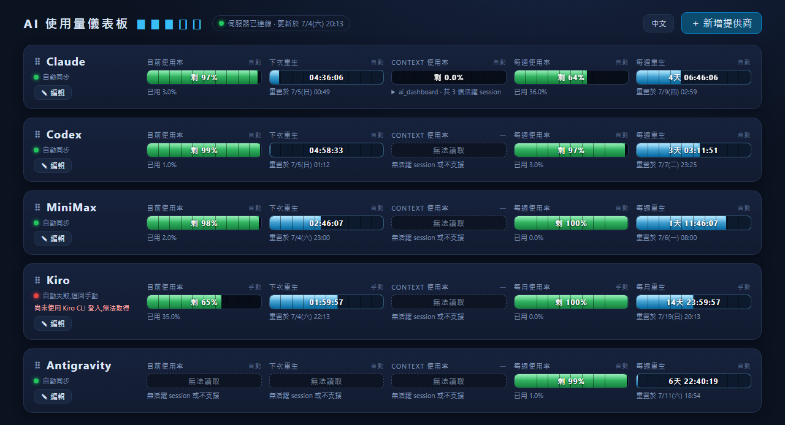

# AI Usage Dashboard

English | [繁體中文](README.md)

A locally-run AI usage dashboard: one row per AI provider, showing current usage,
time to next reset, context usage, and weekly/monthly usage as retro HP bars.
Supports automatic sync for Claude / Codex / MiniMax / Antigravity / Kiro
(Antigravity requires the `agy` CLI to be kept running in a terminal;
Kiro requires `kiro-cli` to be installed and logged in).

Zero runtime dependencies — the frontend is a single `index.html`, and the
`server.js` server uses only Node.js built-in modules, so **no `npm install`
is required** to run it. The server only binds to `127.0.0.1` and is never
exposed externally. The UI supports switching between Traditional Chinese
and English, defaulting to your browser's language.




## Quick Start

The only prerequisite is [Node.js](https://nodejs.org/) (LTS recommended).

Download this project (`git clone` or download the ZIP and extract it), then
from the project folder run the script for your OS:

### Windows

Double-click `start.bat`, or run it from a terminal:

```
start.bat
```

### macOS

Right-click `start.command` in Finder → Open (on first run, Gatekeeper will
block it — right-click once to allow, or run
`xattr -d com.apple.quarantine start.command` in a terminal to remove the
quarantine flag).

You can also run it directly from a terminal:

```bash
./start.command
```

### Linux

Run it from a terminal:

```bash
./start.sh
```

Once started, your browser will automatically open to `http://127.0.0.1:3789`.
If it doesn't open automatically, just visit that address manually.

## Secrets

The MiniMax API Key and other secrets are only used locally: they're encrypted
with AES-256-GCM and stored in `config.json`. The encryption key is derived
from your **local hardware ID** (Windows: BIOS serial number + MachineGuid;
macOS: `IOPlatformUUID`; Linux: `/etc/machine-id`). This means `config.json`
is bound to a single machine and cannot be decrypted if copied to another
computer — there's no need (and you shouldn't) upload or share `config.json`.

## Development / Testing

Only needed if you want to run the Playwright E2E tests:

```bash
npm install
npx playwright install chromium
```

## Floating desktop widget (Windows only, optional)

Besides the regular browser tab, you can also open a borderless, truly (pixel-level) transparent
little window pinned to the top-right corner of the screen (provider cards only — no title bar,
no language toggle; the HP bars and scrollbar are semi-transparent too), built with WPF + WebView2.
Both modes share the same server and can be open at the same time:

| | Regular browser tab | Floating widget |
|---|---|---|
| Launch | Double-click `start.bat` | Just double-click `floating-widget.bat` (it starts the server itself if it isn't already running) |
| Look | Full UI (title bar, language toggle, add-provider button) | Borderless, transparent background, provider cards only, semi-transparent bars/scrollbar |
| Default size | Normal browser window | Auto-resizes to fit exactly one provider card once data loads |
| Resize | Normal browser window controls | Drag the window edges or corners (corners have no visual marker but are still draggable) |
| Move | Normal browser window controls | Press and drag anywhere on the cards or background (a grab cursor and a ⠿ hint appear on hover; buttons, inputs and the sort handle are excluded) |
| Close | Close the browser tab | **Alt+F4** (no title bar / close button by design) |

Before first use of the floating widget, you need to manually fetch 3 official WebView2 SDK DLLs
(about 9MB, from nuget.org — not shipped with the repo):

```powershell
# run from the project root
Invoke-WebRequest -Uri "https://api.nuget.org/v3-flatcontainer/microsoft.web.webview2/1.0.4022.49/microsoft.web.webview2.1.0.4022.49.nupkg" -OutFile webview2.zip
Expand-Archive webview2.zip -DestinationPath webview2_tmp
New-Item -ItemType Directory -Force floating-widget-lib
Copy-Item webview2_tmp\lib\net462\Microsoft.Web.WebView2.Core.dll, webview2_tmp\lib\net462\Microsoft.Web.WebView2.Wpf.dll, webview2_tmp\runtimes\win-x64\native\WebView2Loader.dll floating-widget-lib\
Remove-Item webview2.zip, webview2_tmp -Recurse
```

### Mini bar mode

If even the card widget feels too big, add the `-Mini` switch for a ~20px-tall, screen-width/5-wide
single-line bar showing just one provider at a time (name + bar + percentage + reset countdown).
Just like the card widget, double-click `floating-widget-mini.bat` to launch straight into this
mode (shows the first provider in your saved order by default) — **no need to start `start.bat`
first**; if the server isn't reachable, it's started automatically in the background (output goes
to `server.log`) and the widget window opens once it's ready. You can also run it yourself with a
specific provider:

```
floating-widget.bat -Mini -Provider claude
```

`-Provider` is optional (defaults to the first provider in your saved order). With the mini widget
focused, press **Up/Down** arrow keys to switch which provider it shows. The mini widget has a fixed
size — it can't be resized by dragging edges; press and drag anywhere on the bar to move it around.
